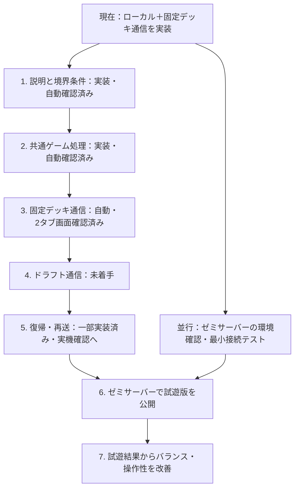

# 開発の優先順位フロー — 寿司デッキバトル

更新日：2026-09-25。`ea3d991` の不具合修正に続き、説明更新・共通ゲーム処理・固定デッキ通信対戦を実装した状態です。

次の目標は、**別々の端末から部屋コードで参加し、ドラフト・対戦・追加注文・勝敗まで遊べるオンライン2人対戦**です。ゼミのサーバーを使う前提で、実装の依存関係と各段階の完了条件を整理しました。

手元の通信試遊には **Node.js＋TypeScript＋Socket.IO** を採用しました。ゼミサーバーの環境・配置方法は未確認です。チェック済み項目ごとに、実装・自動テスト・実ブラウザのどこまで確認したかを記載し、実端末2台での確認とは区別します。

## 現在地

| 状態 | 内容 |
|---|---|
| 実装・確認済み | CPU対戦、同じ端末での2人対戦、3Dドラフト、特急、追加注文 |
| 分離済み | `src/game/` にReactなしで動くカード効果と試合進行。固定P1/P2、カード個体ID、状態＋操作→更新状態＋出来事 |
| 修正済み | 二重召喚、特急未受領での購入消失、時間切れ時のReact状態更新エラー |
| 説明・境界を整理済み | 巻物・光り物・コンボのタイミング、初回0枚は汎用10枚／追加注文0枚は補充なし、20枚上限・締切・完了一度 |
| 通信実装済み | 部屋作成・6桁コード参加、固定16枚の対戦と自動補充、本人別の公開状態、再戦合意 |
| 自動確認済み | ローカル118件（カード74＋進行26＋ドラフト18）、通信統合16件。通信クライアント2つで勝敗まで進行 |
| オンライン実画面確認済み | 実ブラウザ2タブでターン64・P2勝利まで完走。状態同期・再読込・一時離脱からの復帰・再戦・退出を確認 |
| 未実装 | オンラインのドラフト・特急・購入タイマー・追加注文。試遊版では両者へ固定デッキを自動補充 |
| 未確認 | ゼミサーバーの環境・公開範囲、実端末2台の接続、全カードの実画面網羅、購入上限付近の実画面検証 |

検証の詳細は [2026-09-25の動作確認](docs/動作確認_2026-09-25.md) と [2026-09-24の動作確認](docs/動作確認_2026-09-24.md) を参照してください。ファイル分割・3件の不具合修正・光り物三昧は、未着手タスクへ戻しません。

## 優先順位と依存関係

環境確認は最初に始めます。サーバーの回答待ちでも、手元の開発サーバーと2つのブラウザで段階2〜5を進められます。配置先の最小接続テストは環境が分かり次第行い、公開直前まで接続可否を持ち越さないようにします。

| 順序 | 取り組むこと | この順にする理由 | 次へ進む完了条件 |
|---|---|---|---|
| 1 | 説明更新・境界条件の整理 | 現行ルールを基準に移植し、説明の古さと処理の不具合を分ける | 説明が現行ルールと一致し、空デッキ・上限・終了時の扱いが決まる |
| 2 | 共通のゲーム処理 | 同じルールをサーバーとローカル対戦で実行する土台になる | Reactなしで1試合を進行でき、既存の対戦も動く |
| 3 | 固定デッキで通信対戦 | 接続・本人識別・状態同期を小さい範囲で検証できる | 2つのブラウザで参加から勝敗まで進み、両者の結果が一致する |
| 4 | 購入フェーズの通信対応 | 対戦の通信が成立した後に、抽選・予算・時間を組み込める | ドラフト→対戦→追加注文→対戦を一通り遊べる |
| 5 | 切断復帰・異常系 | 再読込や通信断があっても購入・召喚を重複させない | 復帰時の状態が一致し、再送でも二重処理されない |
| 6 | ゼミでの試遊 | 実際のネットワークと端末で一連の遊びを確認できる | 想定する接続元の2端末で1試合完走する |
| 7 | 調整と拡張 | 実際の試遊データを基に優先度を決められる | 主要な不満・不具合を記録し、次の改善対象を選べる |

## 1. ルール説明と境界条件 — 実装・自動確認済み

- [x] `StaffHelpModal.tsx` の巻物コンプを、机に同時3枚で永続ドロー+1／同時5枚で軍艦攻撃×1.5へ更新する。
- [x] 光り物三昧を、大葉トッピング累計3枚で切れ味+3へ更新する。高級三昧は現行ルール一覧から外す。
- [x] コンボごとの発動条件とタイミングを説明する。
- [x] 初回ドラフト0枚は汎用10枚の代替デッキ、追加注文0枚は補充なしと表示する。最低8枚の新ルールは導入しない。
- [x] `draftEngine.ts` で残高・20枚上限・特急3回・配送中・購入済み皿・期限を検証する。
- [x] 19→20枚・特急未受領・手動終了と時間切れ・期限1ms前と期限ちょうどを自動テストで確認する。
- [ ] 購入上限付近の操作を実画面でも網羅する。

通常皿は出現ごとにIDを持ち、周回して別の皿に替わったら古い選択からの購入を拒否します。特急は支払い時にカードを確保し、受領は配送表示だけを消します。締切は実時刻で扱い、タイマーの実行が遅れても購入可能時間を延長しません。

## 2. 対戦処理をReactから分離 — 実装・自動確認済み

- [x] `src/game/battleRules.ts` と `matchEngine.ts` に召喚・ターン終了・交代・消化・ドロー・追加注文完了・勝敗判定を移す。
- [x] 状態を固定のP1/P2で保持し、`activePlayerId` で手番を表す。画面の自分／相手は表示時に選ぶ。
- [x] カードの種類IDと1枚ごとの個体IDを分け、同じたまご2枚も区別する。
- [x] 入力を「状態＋操作」、出力を「更新状態＋出来事」に整理する。抽選用乱数を外から渡せるようにする。時刻が必要なドラフト処理も外部入力にする。
- [x] 攻撃・コンボ演出の待ち時間をルール進行から分け、Reactは確定結果を表示する。
- [x] CPU対戦と同端末2人対戦を接続し、毎操作JSONを往復しながらReactなしで1試合を進める自動テストを追加する。

CPUの即時効果も人間と同じ召喚処理で1枚ずつ解決し、ドロー・消化停止・追加ダメージによる勝敗の扱いを統一しました。消化は**本人の手番開始時**です。旧資料の「ターン終了時」という説明は更新しました。

残る確認：CPU対戦・同端末2人対戦の画面操作、演出、追加注文後の復帰を継続して確認する。

## 3. 固定デッキの通信対戦 — 実装・統合・実ブラウザ2タブ確認済み

この段階の固定デッキは通信を検証するための暫定機能です。最終的な試遊版には段階4のドラフトを含めます。

- [x] 部屋作成・6桁の部屋コードでの参加・2人そろったら固定16枚で開始する。
- [x] 接続とプレイヤーをサーバーで対応付け、自己申告のプレイヤーIDによるなりすましを拒否する。
- [x] サーバーが共通ゲーム処理で手番・手札・AP・机上限を検証して操作を確定する。
- [x] 操作ID・受領確認・対戦ID・更新番号を照合し、重複操作や前試合の操作を拒否する。
- [x] 操作後は各プレイヤー向け状態一式を配信する。自分の手札だけを送り、相手の手札・山札順・トークンを状態配信へ含めない。
- [x] 送信待ち・操作拒否・相手の手番・切断・再戦希望を画面に表示する。
- [x] 2つのSocket.IOクライアントで固定デッキ対戦を勝敗まで進め、公開情報と状態一致を統合テストで確認する。
- [x] 実ブラウザ2タブを操作して参加からターン64・P2勝利まで完走し、双方の勝者・お腹の一致を確認する。
- [x] 固定デッキの自動補充、巻物コンプのドロー+1、召喚ボタンのダブルクリックで1枚だけ召喚されることを実画面で確認する。
- [x] 双方の再戦合意でターン1・お腹0・手札5枚／山札11枚へ戻り、退出で部屋を終了することを実画面で確認する。

オンライン試遊では両者の手札と山札が尽きたら固定デッキを自動補充します。ドラフト・特急・購入を伴う追加注文は段階4です。今回の画面確認は同じ端末の2タブで行いました。実端末2台・ゼミサーバーでの確認は残っています。

## 4. ドラフト・特急・追加注文の通信対応 — 未着手

- [ ] サーバーが提示する皿、価格、残高、購入済みカード、特急回数を管理する。
- [ ] 提示中の皿にIDを付け、購入要求を受けたら販売期間・未購入・残高・デッキ上限を確認する。ブラウザから送られた金額や完成デッキをそのまま採用しない。
- [ ] 90秒／45秒の締切をサーバー時刻で管理する。端末のカウントダウンは表示用にし、終了通知は一度だけ確定する。
- [ ] 特急は支払い時に購入確定し、未受領で終了しても失わない現行動作を維持する。
- [ ] レーンの抽選・出現時刻と3D表示を分ける。寿司の移動は各端末で描画し、座標の毎フレーム送信は行わない。
- [ ] 追加注文でも同じ購入処理を使い、対戦状態と購入カードを保持して復帰する。

初版の提案：各プレイヤーに独立したレーンを用意し、ドラフトは現行と同様に順番制にします。同時に同じ皿を取り合う仕様は別のゲームルールになるため、導入する場合はこの段階に入る前に決めます。

完了条件：部屋参加から初回ドラフト・対戦・追加注文・勝敗まで、2つのブラウザで一通り進めること。

## 5. 切断復帰と異常系 — 固定デッキ対戦の範囲を先行実装

- [x] 再参加トークンを同じタブのsessionStorageへ保存し、接続回復時に本人向けの最新状態へ復帰する。
- [x] 片方の切断中は操作を停止し、120秒の復帰猶予を設ける。期限を超えたら部屋を終了する（棄権勝利の付与は未実装）。
- [x] 満室参加、他人のカード、不正なトークン、予約済みの席への新規参加、旧接続の置換、猶予切れを統合テストで確認する。
- [x] 同じ操作の再送は一度だけ処理する。操作IDの別内容での再利用・古い更新番号・前試合の操作を拒否する。
- [x] 勝敗確定後に双方が希望したときだけ再戦する。明示的な退出は部屋全体を終了する。
- [x] 操作の応答を8秒以内に確認できない場合、操作を別IDで再送せず、部屋の最新状態を取得するクライアント処理を実装する。
- [x] 実ブラウザでP2を再読込し、手札・手番を復元する。相手の一時離脱中はP1の操作を無効にし、復帰後に再開することを確認する。
- [ ] 応答だけが消失する状況や実端末の通信断を再現し、再同期と表示を確認する。
- [ ] 段階4の後に、ドラフト締切直前の購入・追加注文中の復帰・支払い重複を通信経由でも検証する。
- [x] CPUの手番が戻ること、同端末2人の受け渡し、二重召喚防止、特急未受領終了、時間切れの主要操作を実画面で回帰確認する。全カードの画面網羅は未実施。

現行実装はサーバー1プロセスのメモリで部屋と試合を保持します。サーバー再起動後の試合復元・DB保存・複数サーバー対応はありません。再起動で部屋が消えた場合は再参加が拒否され、新しい部屋を作成する必要があります。

## 並行作業：ゼミサーバーの確認

ゼミサーバーは未確認です。手元の2プロセスによる接続は先に実装してあり、環境確認と並行して段階3の画面検証・段階4を進められます。

- [ ] Node.jsまたはDockerを常時実行できるか、起動・再起動をどう管理するかを確認する。
- [ ] 遊ぶ範囲を学内のみ／VPN経由／学外公開から決め、想定する接続元から到達できるかを確認する。
- [ ] 利用可能なURL、HTTPSの終端、リバースプロキシのWebSocket対応を確認する。
- [ ] 環境が分かり次第、最小の接続・送受信・再接続テストをゼミサーバーで行う。

Socket.IOは自動再接続を備えますが、操作の到達保証やゲーム状態の復元はアプリ側でも設計します。[公式説明](https://socket.io/docs/v4/)・[配信保証](https://socket.io/docs/v4/delivery-guarantees/)・[リバースプロキシ設定](https://socket.io/docs/v4/reverse-proxy/)

## 6. ゼミサーバーで試遊版を公開する

前提：段階5の完了と、上記の環境・接続確認が済んでいること。

- [ ] Reactのビルド成果物と対戦サーバーを配置し、起動手順・更新手順・ログの確認方法を残す。
- [ ] 想定する接続元の実端末2台で、ドラフトから勝敗まで確認する。学外利用を選んだ場合は学外からも確認する。
- [ ] 複数の部屋を同時に動かし、別の試合へ操作や情報が混ざらないことを確認する。
- [ ] 実際の参加人数に合わせて試遊し、接続失敗・処理時間・切断復帰・3D表示の重さを記録する。

## 7. 試遊結果から改善する

- [ ] コンボの発動率、試合ターン数、先後の勝率、追加注文回数を観測する。
- [ ] 共通の対戦処理を使う自動対戦で傾向を調べ、人の試遊と合わせてカードを調整する。簡易CPU同士の勝率だけで対人バランスを断定しない。
- [ ] スマートフォンなどで操作しにくい箇所、説明不足、待ち時間を改善する。
- [ ] 起動時間や描画性能を測り、必要な箇所から読み込み・描画を軽くする。

## 今は優先度を下げるもの

| 対象 | 着手する目安 |
|---|---|
| CPUの高度化・CPU用ドラフト | オンライン試遊後、練習相手の改善が必要になったとき |
| 薬味・専用サイドメニュー・おまかせ・高級三昧 | 現行ルールの通信対戦とバランスが安定してから |
| GLTFモデル・演出の大幅追加 | 対戦の操作性を確認した後。実際の操作を妨げる表示問題は先に直す |
| ランキング・アカウント・観戦・自動マッチング | 部屋コードで遊べる試遊版を使って需要を確認してから |
| DBによる試合復元・複数サーバー対応 | 再起動後の継続や規模の要件が生じたとき |
| 未使用の旧画面・Pixi.js・Zustandの整理 | 小さい独立した変更として並行実施できる。段階2に必要な型の整理は先に行う |

未使用コードを消すだけで配信ファイルが必ず小さくなるとは限りません。現在のビルド警告は、実際に配信する内容を測ってから対処します。

## 手元で通信試遊を起動する

1. 初回のみ `npm install`。
2. ターミナル1で `npm run server`（既定は `127.0.0.1:3001`）。
3. ターミナル2で `npm run dev`（`localhost:5173`）。
4. 2つのブラウザでオンライン対戦を選び、片方の部屋コードをもう片方へ入力する。

ブラウザの接続先は同じオリジンの `/socket.io` です。Viteが `http://127.0.0.1:3001` へHTTP/WebSocketを中継します。環境変数は `HOST`（既定 `127.0.0.1`）、`PORT`（`3001`）、`SUSHI_ALLOWED_ORIGINS`（既定 `http://localhost:5173,http://127.0.0.1:5173`）。公開環境では許可オリジンとWebSocket対応の中継設定が必要です。ポートを変える場合はViteのプロキシ先も合わせます。

## 次に着手する作業

1. CPU対戦・同端末2人対戦の最終回帰確認を終える。
2. 段階4のドラフトに、サーバー管理の提示皿・購入・締切を追加する。
3. 購入を含む切断復帰・期限境界と、実端末2台での対戦を検証する。
4. 並行してゼミサーバーの実行環境・利用範囲・HTTPS・プロキシ設定を確認する。

## 変更時の検証

- 実装変更時：`npm test`（118件）、`npm run build`、`npm run lint`。
- 通信変更時：`npm run typecheck:server`、`npm run test:online`（16件）、2つのブラウザで操作確認。
- ルール・カード変更時：`node scripts/gen-datasheet.mjs` で資料を再生成し、説明も確認する。
- 通信導入後：2つのブラウザ、実端末2台、切断・再読込を含む一連の対戦を確認する。
- この優先順位資料だけを更新した場合：リンクと差分を確認する。ゲームのテストを実行したことにはしない。

仕様やサーバー条件が決まったら該当項目を更新します。実装、自動テスト、ブラウザ確認、実端末確認を区別し、確認していない範囲を完了扱いにしません。
