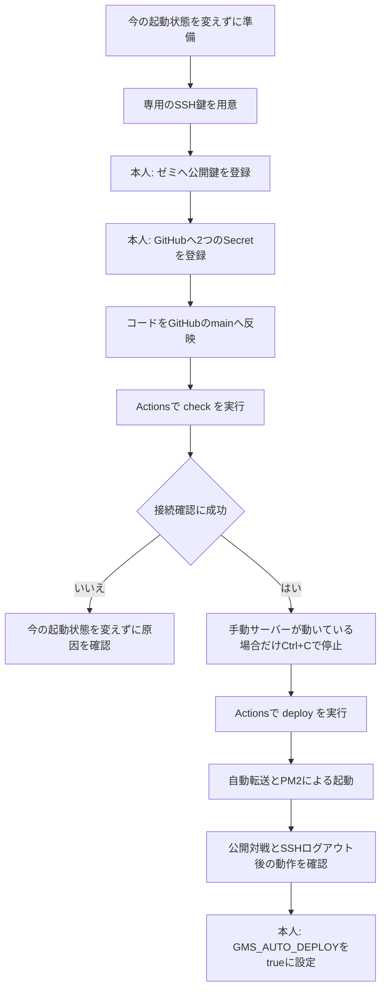
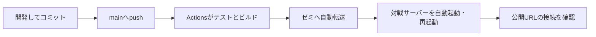

# アップデート後に対戦サーバーを自動起動する

今回の目標は、GitHubの`main`へ更新を送ると、画面・対戦プログラムの転送と起動・再起動まで自動で終わることです。GitHub Actionsが更新作業を実行し、PM2が対戦プログラムをターミナルとは別に動かします。ゼミサーバー全体の設定変更は行いません。

## 初回設定中の確認結果（2026-09-26）

| 項目 | 結果 |
| --- | --- |
| 公開URLでの対戦 | 9月25日に確認済み。2画面で参加・召喚・ターン交代・再読み込み後の復帰が成功 |
| 召喚のダブルクリック | 公開画面で確認済み。1枚だけ召喚され、APと手札も1枚分だけ消費 |
| 現在の起動状態 | ご本人が手動の対戦プログラムを停止済み。9月26日にWeb側の応答と対戦APIの503を確認 |
| 自動転送・起動のプログラム | ローカルに実装済み。更新・起動・復旧の6ケースをローカルで検証済み |
| 初回用の接続確認 | `operation: check`を追加。実行時の分岐・構文は検証済み。実際のGitHubからのSSH接続は未確認 |
| GitHubへの反映 | 今回の調査時点の公開mainは`089e6ab`。Actions用ファイルはまだ公開mainに存在しない |
| 専用のSSH鍵 | プロジェクトの`.cache/gms-actions-key/`に作成済み。Git管理対象外で、秘密鍵の内容は出力していない |
| 公開鍵・Secretsの登録 | ゼミへの公開鍵登録と、GitHubの`GMS_SSH_KEY`・`GMS_KNOWN_HOSTS`登録を確認済み。鍵を使った実接続はこれから |
| 自動化の本番稼働 | これから。下の初回設定と実サーバーでの切り替えが必要 |

## 初回だけ行う順番

| 作業 | 担当・必要なこと |
| --- | --- |
| コード・手順・検証 | Codexで準備。公開済みの画面を使った動作確認も担当 |
| 専用鍵の用意 | Macのこのプロジェクト内に作成。既存の個人用秘密鍵は使わない |
| ゼミへの公開鍵登録 | ご本人のログイン済みアカウントで実行。ゲームが動く端末とは別のSSH端末を使う |
| GitHubのSecrets登録 | ご本人がGitHubの設定画面で2つ登録。秘密鍵はチャットへ貼らず、設定画面へ直接貼る |
| コードを公開mainへ反映 | ローカルコミットをpush。コミットした変更だけがActionsの対象になる |
| `check`と初回`deploy` | GitHubのActions画面から実行。失敗内容の調査はCodexで支援可能 |
| 最初の手動サーバー停止 | 動いている場合だけ、ご本人が元の端末でCtrl+C。すでに停止済みなら不要 |
| 自動更新の有効化 | ご本人がGitHubのリポジトリ変数を1つ登録 |

登録するSecretは`GMS_SSH_KEY`と`GMS_KNOWN_HOSTS`、最後に登録する変数は`GMS_AUTO_DEPLOY=true`です。コピー用のコマンドと設定画面へのリンクは[詳細手順](GitHub%20Actions自動デプロイ.md)にあります。

**公開鍵と2つのSecretsは登録済みです。次はコードをGitHubへ反映し、`check`を実行します。** 専用鍵やSecretsを作り直す必要はありません。`check`ではSSH接続と配置の準備を必須項目として確認し、停止中のゲームは別の診断結果として表示します。

## 設定後のアップデート

通常の更新でCyberduckの転送や`npm run server`の手入力は不要になります。Mac内のファイルを保存しただけ、またはコミットしただけでは更新されず、GitHubへのpushが開始の合図です。Cyberduckでファイルを上げるだけでは、この自動起動処理は実行されません。

## 失敗した場合と今回の範囲

- **`check`が失敗**：現在のゲームは変更しません。GitHubからのSSHがゼミのネットワーク制限で拒否されるかは未確認です。拒否された場合は結果を調べ、Macから同じ配置スクリプトを実行する方法を検討します。
- **初回の`deploy`が失敗**：旧手動サーバーのフォルダは残ります。ログと現在の起動状態を確認してから、必要に応じて手動起動へ戻します。復旧コマンドは詳細手順にあります。
- **2回目以降の更新に失敗**：切り替え前の検証で失敗すれば旧版を維持します。切り替え中の失敗では管理済みの旧版へ戻す処理があります。ただし公開URLの通信確認だけが失敗した場合は警告になり、自動では戻しません。
- **更新時の対戦**：再起動すると進行中の部屋は消えます。更新は対戦中の人がいないタイミングで行います。
- **ゼミサーバー本体の再起動**：OS起動に合わせた自動起動は今回の対象外です。必要になった時点でActionsの`deploy`を手動実行します。

完了の判定は、初回切り替え後にSSHからログアウトしても対戦でき、次の`main`更新で転送と起動が自動実行されることです。現時点では、その本番確認が残っています。
